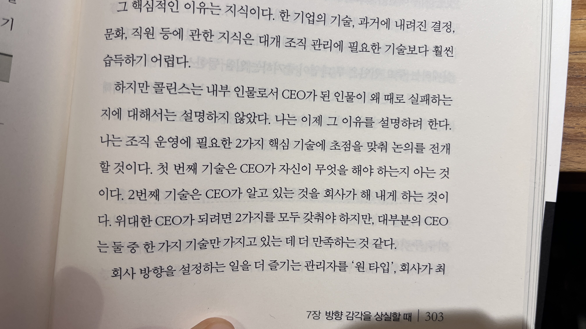
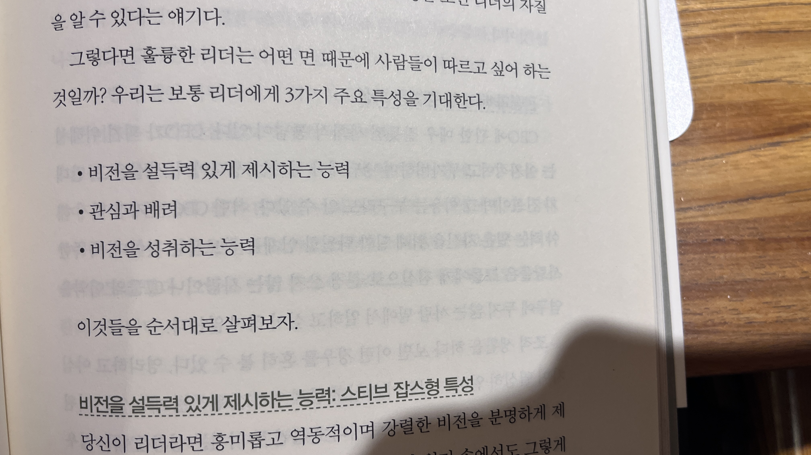

> Author: Ben Horowitz

# 메모

![[IMG_4135.png|300]]

안좋은 일은 인정하기 싫어하는게 어쩔수 없는 인간인가 보다. 이런 점을 봤을때, 내가 24-1 학기를 보내며 몸소 체득한, 나쁜 결과가 나왔을때 그걸 타파하기 위해 부단히 노력해서 좋은 결과로 다시금 이끌어낸 것을 잊지말고 살아야겠다. 명심하자, 좋은결과도 마냥 기뻐하며 받아들이지 말고 의심, 나쁜결과는 회피하지 말고 맞서서 더 나은 사람이 되도록.

이미 일어난 일에 대한 후회는 하지 말자. 앞으로 어떻게 해쳐나가야 할지에 대한 고민을 더 하자.

좋은 조직이란 **자기 일에 온전히 집중하고**, 또 맡은 일을 잘 완수해내면 **회사 차원에서나 개인적으로 좋은 결과를 얻을 거라는 확신**을 가진다.

> 여기서 `좋은 결과`란 무엇을 의미하는 것일까?

만사가 순조롭게 흘러갈 때는 좋은 조직 문화가 그다지 중요하지 않다. 그러나 위기가 다가왔을 때는 그것이 조직의 생사를 가르는 결정적 요인이 될 수 있다. 더욱 중요한 점은 위기는 언제라도 닥쳐올 수 있다는 것이다. 또 궁극적으로 회사는 좋은 회사가 되는 것 자체를 목적으로 삼아야 한다.

> [!Priority]
> 사람 -> 제품 -> 수익

^벤 호로위츠가 직원과의 일대일 면담에 활용해서 매우 좋은 효과를 거두었던 질문들

^다수와 반하는 결정을 내리는 경우 큰 용기가 필요하다. 그 이유는 그것이 더 안전해 보이기 때문이다. 그러나, 이는 회사를 고통으로 이끄는 덫으로 작용할 수도 있다.

^회사 방향을 설정하는 더 즐기는 관리자 -> "원 타입" / 회사가 최고 수준으로 성과를 올리게 만드는 것을 더 즐기는 관리자 -> "투 타입"

훌륭한 CEO가 되기 위해선 두 가지 특징이 모두 필요하다. 그러나 대부분의 창업 CEO는 원 타입에 속하며, 이는 내부 CEO 승계를 어렵게 만드는 요소 중 하나이다. CEO가 원 타입이기 때문에 임원진은 투 타입을 뽑는 경우가 많으며, 중요한 결정으로 방향 전환을 해야하는 상황에서 결정이 지연되기 마련이다. 그렇다고 임원보다 낮은 직급의 직원을 CEO로 임명할 경우에 내부적으로 혼란해지고, 많은 임원진들의 사직까지 이끌수 있다.

^비전을 설득력 있게 제시하는 능력: 스티브 잡스형 특성 / 관심과 배려: 빌 캠벨형 특성 / 비전을 성취하는 능력: 앤디 그로브형 특성
